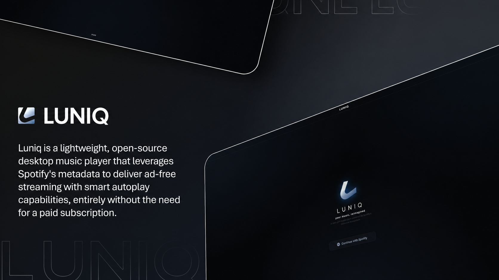

<div align="center">
  

  <br />

  <h1>─── ✧ L U N E &nbsp; M U S I C ✧ ───</h1>

  <p><b>Lune Music</b> (also known as <b>Lune</b>) is a lightweight, open-source desktop music player developed by <b>saraansx</b>. It leverages Spotify's metadata to deliver ad-free streaming with smart autoplay capabilities, entirely without the need for a paid subscription. Built for performance and beautifully designed, it offers a fast and distraction-free environment for your entire music library.</p>

  <br />

  <p>
    <a href="https://github.com/saraansx/Lune-Music/blob/main/LicENSE">
      
    </a>
    
    
    <a href="https://discord.gg/TardrVJT9N">
      
    </a>
  </p>
</div>

<br />

<div align="center">
  
  <table border="0" cellpadding="0" cellspacing="0" width="100%">
    <tr>
      <td width="50%"></td>
      <td width="50%"></td>
    </tr>
    <tr>
      <td colspan="2"></td>
    </tr>
  </table>
</div>

<br />

### / Download

| | |
| :--- | :--- |
|  Windows - [WinGet](https://learn.microsoft.com/en-us/windows/package-manager/winget/) | `winget install saraansx.Lune` |
|  Windows - [Scoop](https://scoop.sh/) | `scoop bucket add saraansx https://github.com/saraansx/scoop-bucket`<br>`scoop install lune` |

_Or grab the latest setup directly from **[Releases](https://github.com/saraansx/Lune-Music/releases)**._

<br />

### / Development

```bash
git clone https://github.com/saraansx/Lune-Music.git
cd Lune
npm install
npm run dev
```

<br />

### / Features

- **Ad-Free** — High-quality streaming without a paid subscription.
- **Offline** — Save any track, album, or playlist for high-speed offline playback.
- **Library** — Seamlessly mix local music with your Spotify collections.
- **Lyrics** — Real-time scrolling lyrics support powered by LRCLib.
- **Discord** — Built-in Rich Presence to share your current track with friends.
- **Design** — Minimalist interface with customizable HSL-based accent colors.
- **Performance** — Fast, smooth scrolling even with thousands of saved tracks.
- **Localization** — Fully translated into multiple languages including English and Hindi.
- **Optimized** — Native media keys, smart caching, and automatic updates.

<br />

### / Tech Stack

Lune is built on a modern, high-performance stack designed for the desktop:

- **Logic**: [React 18](https://reactjs.org/) + [TypeScript](https://www.typescriptlang.org/)
- **Desktop Foundation**: [Electron 30](https://www.electronjs.org/)
- **Build Tooling**: [Vite 5](https://vitejs.dev/)
- **Database**: [Better-SQLite3](https://github.com/WiseLibs/better-sqlite3) for persistence and unified library management.
- **Audio Engine**: `yt-dlp` for optimized stream harvesting and download management.
- **Presence**: [Discord-RPC](https://github.com/discordjs/RPC) for seamless social integration.
- **Styling**: Pure, high-performance Vanilla CSS with a focus on modern glassmorphism and HSL-based design systems.

<br />

### / Support

Enjoying Lune? Consider giving us a ⭐ to support the development and join our **[Discord](https://discord.gg/TardrVJT9N)** for updates!

<br />

### / Engagement

[](https://star-history.com/#saraansx/Lune-Music&Date)

<br />

### / License

Lune is proudly open-source and licensed under the **[GPL-3.0 License](https://github.com/saraansx/Lune-Music/blob/main/LicENSE)**.

This ensures that the project remains free and open. Any modifications or derivative works distributed to others must also be open-source and released under the same license.

---

<div align="center">
  <sub>✦ Lune Music by saraansx ─ Crafted for the Aesthetic Listener ✦</sub>
</div>
